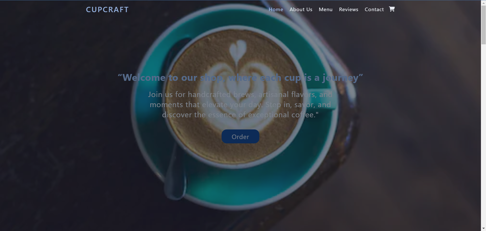

# Sample Static Coffee Shop Website

This static coffee shop website is a sleek and modern design created with HTML, CSS, Tailwind CSS and JavaScript. It provides a welcoming online presence for a local coffee shop, showcasing their menu and ambiance. The website is fully responsive, ensuring a seamless experience across all devices.

## Key Features:

1.  Home Page:

    - Attractive hero section with a background image of the coffee shop.
    - Brief introduction about the coffee shop and its offerings.
    - Call-to-action buttons for the menu and contact information.

2.  About Us Section:

    - Provides a brief history of the coffee shop, its mission, and values.
    - Highlights the unique selling points and specialties of the coffee shop.
    - Includes images of the shop and its team.

3.  Menu Section:

    - Tabs Navigation: Users can easily switch between different categories of items such as All, Coffee, and Snacks.
    - JavaScript Functionality: The tab navigation is implemented using JavaScript to enhance user experience by showing and hiding items based on the selected tab.
    - Menu Items: Each category displays relevant items with descriptions and prices.

4.  Reviews Section:

    - Showcases customer reviews and testimonials.

5.  Contact Us Section:

    - Contains contact details such as phone number, email, and message.
    - Includes a contact form for users to send messages directly from the website.

## Languages

- HTML
- CSS
- Tailwind CSS
- JavaScript

## Conclusion:

This static coffee shop website is designed to be user-friendly, visually appealing, and functional. The use of HTML, CSS, Tailwind CSS and JavaScript ensures a responsive and modern website that effectively showcases the coffee shop's menu and atmosphere.
